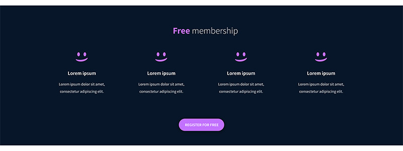
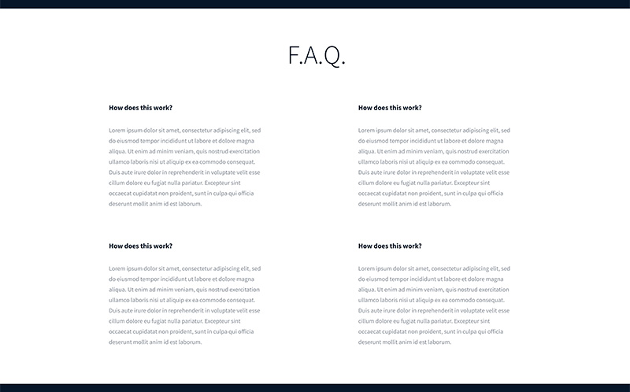

# Atlas Web Development - CSS Advanced

This project is a continuation of the "HTML Advanced" project, focusing on the CSS and styling aspects. The Figma designer file attached below is used as a reference.

## Project Overview 📌


## Directory Structure 📚

```
atlas-web-development/
| -- html_advanced/
| --| -- README.md
|   | -- index.html
|   | -- images/
|   | -- | -- ...
|   | -- style/
|   | -- | -- styles.css
```

## Header and Banner 📢

The header section includes a logo and the block of three navigation links. The banner section consists of two blocks: one with a heading, text, and a button, and another with four blocks containing images, headings, and text.


## Quote 🧵

The quote section features an image, a quote tag, an author quote, and additional text.


## Videos 📽️

The videos section includes a heading and a block of four video items, each with an image, heading, text, author block, and rating block.


## Membership 💸

The membership section includes a heading and a block with four items, each containing an image, heading, text, and a button.



## FAQ ❓

The FAQ section comprises a block with two row blocks, each with two item blocks, including a heading and text.



## Footer 🎯

The footer section includes a block with an image and another block with images linked to social media, along with additional text.


<br />

### End product


## Tools/Frameworks used 📖
- HTML/CSS
- Figma

## Author/Contact info :phone: :mailbox:

* **Svitlana Pavlovska** **|** [Github](https://github.com/SvitLanaPavl) **|** [LinkedIn](https://www.linkedin.com/in/svitlana-pavlovska-833b43184/) **|** [Email](mailto:lanapavlovska90@gmail.com)
##


